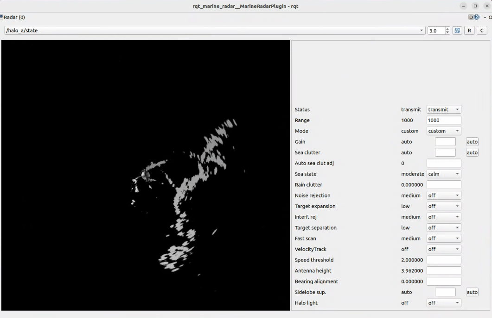

# Marine Radar Plugin for rqt

Allows viewing of marine radar data as well as controlling supported hardware.



## Installation

Clone this repo into your workspace: 

```git clone git@github.com:CCOMJHC/rqt_marine_radar.git```

### Dependencies

Install package dependencies for your ROS2 distribution:

```sudo apt install ros-<distro>-marine-sensor-msgs```

Alternatively, you can use the development package here: https://github.com/apl-ocean-engineering/marine_msgs

Clone the `marine_radar_control_msgs` repo: 

```git clone git@github.com:CCOMJHC/marine_radar_control_msgs.git```

### Build

From the root of your workspace, run `colcon build`.


## Usage

To run the plugin standalone in RQT, run: 

```ros2 run rqt_marine_radar rqt_marine_radar```

(When running after the first build/install, you may need to append the `--force-discover` argument to the above command for RQT to discover the plugin.)

To use the plugin alongside other RQT plugins, run RQT and load the plugin from the Plugins menu (`Plugins > Marine Radar Plugin`). (You may also need to append `--force-discover` after the first build/install, e.g. `rqt --force-discover`).


## Topics

The `simrad_halo_radar` node publishes data and state from each of the dual frequencies of the Halo radar. The first frequency is addressed by `/halo_a` and `/halo_b`. `<radar_freq_address>` in the topic names below refers to either the `/halo_a` or `/halo_b` topics.

### Subscribed Topics 

| Topic                        | Data Type                                       | 
|------------------------------|-------------------------------------------------|
| `<radar_freq_address>/data`  | `marine_sensor_msgs/msg/RadarSector`            |
| `<radar_freq_address>/state` | `marine_radar_control_msgs/msg/RadarControlSet` |


### Published Topics 

| Topic                               | Data Type                                         | 
|-------------------------------------|---------------------------------------------------|
| `<radar_freq_address>/change_state` | `marine_radar_control_msgs/msg/RadarControlValue` |
